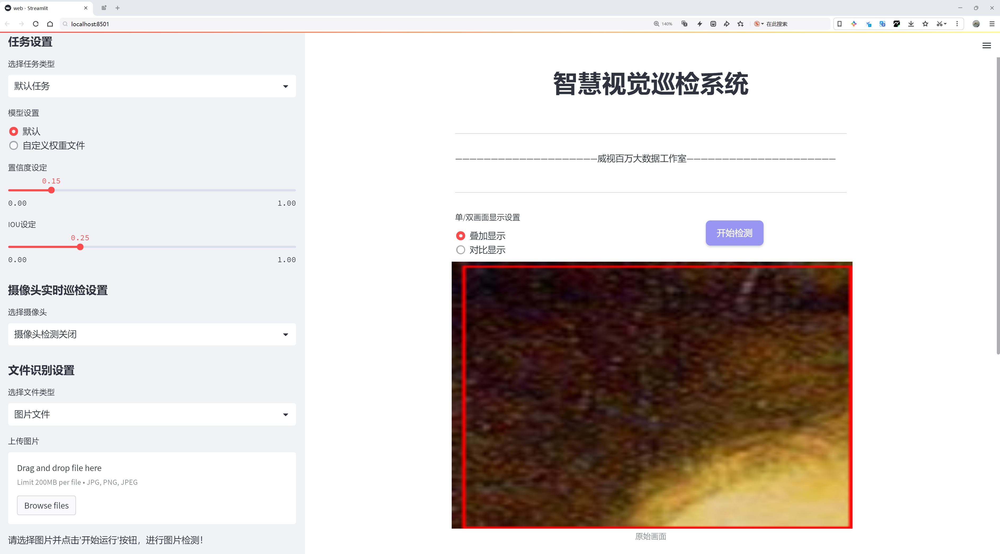
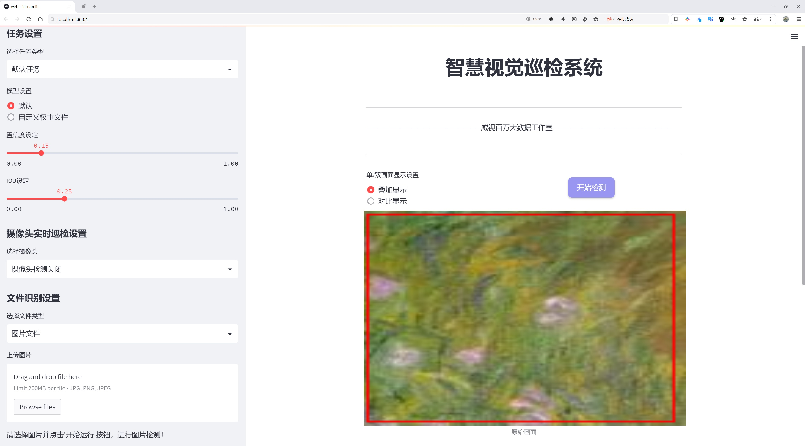
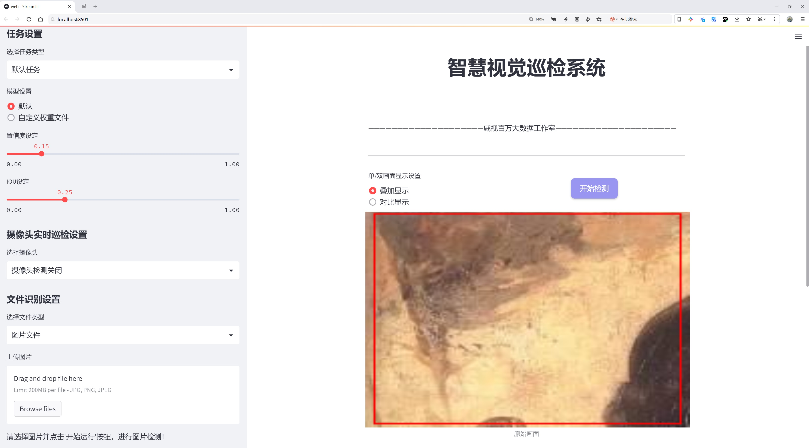
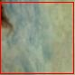
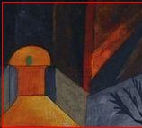
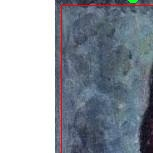
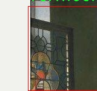

# 艺术作品风格识别检测系统源码分享
 # [一条龙教学YOLOV8标注好的数据集一键训练_70+全套改进创新点发刊_Web前端展示]

### 1.研究背景与意义

项目参考[AAAI Association for the Advancement of Artificial Intelligence](https://gitee.com/qunmasj/projects)

项目来源[AACV Association for the Advancement of Computer Vision](https://kdocs.cn/l/cszuIiCKVNis)

研究背景与意义

随着人工智能技术的迅猛发展，计算机视觉领域的研究逐渐成为热点，尤其是在艺术作品的分析与识别方面。艺术作品不仅是文化的载体，更是人类情感与思想的表达。如何通过计算机技术对艺术作品进行有效的风格识别，已成为艺术研究、文化遗产保护以及数字艺术创作等多个领域的重要课题。近年来，深度学习尤其是卷积神经网络（CNN）的广泛应用，使得图像识别的准确性和效率得到了显著提升。YOLO（You Only Look Once）系列模型作为一种高效的目标检测算法，因其实时性和高精度的特点，已被广泛应用于各类图像处理任务。

本研究旨在基于改进的YOLOv8模型，构建一个艺术作品风格识别系统。该系统将针对6200幅艺术作品进行风格分类，涵盖20种不同的艺术家风格，包括著名的卡拉瓦乔、塞尚、库尔贝、达利、德加、戈金、霍普、康定斯基、克利、马奈、马蒂斯、莫迪利亚尼、莫奈、伦勃朗、雷诺阿、罗斯科、修拉、维拉斯奎兹和维米尔等。这些艺术家代表了不同的艺术流派和风格，反映了艺术史的发展脉络与多样性。

在当前的艺术作品分析中，传统的手工分类方法不仅耗时耗力，而且主观性强，容易受到个人审美观的影响。因此，构建一个基于深度学习的自动化艺术风格识别系统，能够有效提高识别的准确性和效率，具有重要的理论和实践意义。通过对不同艺术风格的学习与分析，系统能够帮助艺术研究者更好地理解艺术作品的风格特征，促进艺术教育与传播。同时，该系统也为数字艺术创作提供了新的工具，艺术家可以借助该系统快速识别和融合不同风格，激发创作灵感。

此外，随着数字化时代的到来，艺术作品的数字化存档与保护显得尤为重要。通过建立一个高效的艺术风格识别系统，能够为艺术作品的数字化管理提供技术支持，帮助博物馆、画廊等机构更好地进行艺术品的分类与检索，提升艺术品的可访问性与可视化体验。

综上所述，基于改进YOLOv8的艺术作品风格识别系统的研究，不仅为计算机视觉与艺术领域的交叉研究提供了新的视角，也为艺术作品的数字化保护与传播开辟了新的路径。通过本研究的深入开展，期望能够推动艺术风格识别技术的发展，促进人们对艺术作品的理解与欣赏，为文化遗产的保护与传承贡献力量。

### 2.图片演示







##### 注意：由于此博客编辑较早，上面“2.图片演示”和“3.视频演示”展示的系统图片或者视频可能为老版本，新版本在老版本的基础上升级如下：（实际效果以升级的新版本为准）

  （1）适配了YOLOV8的“目标检测”模型和“实例分割”模型，通过加载相应的权重（.pt）文件即可自适应加载模型。

  （2）支持“图片识别”、“视频识别”、“摄像头实时识别”三种识别模式。

  （3）支持“图片识别”、“视频识别”、“摄像头实时识别”三种识别结果保存导出，解决手动导出（容易卡顿出现爆内存）存在的问题，识别完自动保存结果并导出到tempDir中。

  （4）支持Web前端系统中的标题、背景图等自定义修改，后面提供修改教程。

  另外本项目提供训练的数据集和训练教程,暂不提供权重文件（best.pt）,需要您按照教程进行训练后实现图片演示和Web前端界面演示的效果。

### 3.视频演示

[3.1 视频演示](https://www.bilibili.com/video/BV1tqsUeuE7X/)

### 4.数据集信息展示

##### 4.1 本项目数据集详细数据（类别数＆类别名）

nc: 20
names: ['Caravagio', 'Cezanne', 'Courbet', 'Dali', 'Degas', 'Gauguin', 'Gorky', 'Hopper', 'Kandinsky', 'Klee', 'Manet', 'Matisse', 'Modigliani', 'Monet', 'Rembrant', 'Renoir', 'Rothko', 'Seurat', 'Velaquez', 'Vermeer']


##### 4.2 本项目数据集信息介绍

数据集信息展示

在本研究中，我们采用了名为“pieces”的数据集，以改进YOLOv8的艺术作品风格识别系统。该数据集包含20个不同的艺术风格类别，旨在为深度学习模型提供丰富的训练样本，以便更好地识别和分类各种艺术作品。数据集的类别涵盖了从文艺复兴到现代艺术的多个重要艺术流派和风格，具体包括：Caravagio、Cezanne、Courbet、Dali、Degas、Gauguin、Gorky、Hopper、Kandinsky、Klee、Manet、Matisse、Modigliani、Monet、Rembrandt、Renoir、Rothko、Seurat、Velazquez和Vermeer。这些艺术家不仅在各自的时代具有重要影响力，而且他们的作品风格各异，展现了不同的艺术表现手法和情感表达。

数据集“pieces”的构建旨在提供一个多样化的样本库，以便模型能够学习到不同艺术风格的特征。每个类别都包含了大量的图像数据，这些图像经过精心挑选，确保能够代表该艺术家的典型作品。通过对这些作品的深入分析，模型能够识别出每种风格的独特元素，如色彩运用、构图方式、笔触风格以及主题选择等。这种细致的分类不仅有助于提高模型的识别准确性，还能为艺术作品的风格分析提供更加全面的视角。

在训练过程中，YOLOv8模型将通过对“pieces”数据集的学习，逐步掌握不同艺术风格的特征。模型将通过卷积神经网络（CNN）提取图像特征，并利用这些特征进行分类和定位。通过对大量艺术作品的学习，模型将能够在新的、未见过的图像中识别出相应的艺术风格，从而实现高效的风格识别。

此外，数据集的多样性也为模型的泛化能力提供了保障。不同艺术家的作品在风格上虽然存在明显的差异，但在某些元素上也可能存在交集。通过对这些交集的学习，模型能够更好地适应不同风格之间的微妙变化，从而提高其在实际应用中的表现。无论是在艺术品鉴赏、博物馆展览推荐，还是在艺术教育领域，这种风格识别系统都将发挥重要作用。

综上所述，数据集“pieces”不仅为YOLOv8模型的训练提供了丰富的样本，也为艺术作品的风格识别奠定了坚实的基础。通过对20种艺术风格的深入学习，模型将能够在艺术作品的分类和分析中展现出卓越的能力，为艺术研究和应用提供新的视角和工具。










### 5.全套项目环境部署视频教程（零基础手把手教学）

[5.1 环境部署教程链接（零基础手把手教学）](https://www.ixigua.com/7404473917358506534?logTag=c807d0cbc21c0ef59de5)


[5.2 安装Python虚拟环境创建和依赖库安装视频教程链接（零基础手把手教学）](https://www.ixigua.com/7404474678003106304?logTag=1f1041108cd1f708b01a)

### 6.手把手YOLOV8训练视频教程（零基础小白有手就能学会）

[6.1 手把手YOLOV8训练视频教程（零基础小白有手就能学会）](https://www.ixigua.com/7404477157818401292?logTag=d31a2dfd1983c9668658)

### 7.70+种全套YOLOV8创新点代码加载调参视频教程（一键加载写好的改进模型的配置文件）

[7.1 70+种全套YOLOV8创新点代码加载调参视频教程（一键加载写好的改进模型的配置文件）](https://www.ixigua.com/7404478314661806627?logTag=29066f8288e3f4eea3a4)

### 8.70+种全套YOLOV8创新点原理讲解（非科班也可以轻松写刊发刊，V10版本正在科研待更新）

由于篇幅限制，每个创新点的具体原理讲解就不一一展开，具体见下列网址中的创新点对应子项目的技术原理博客网址【Blog】：


[8.1 70+种全套YOLOV8创新点原理讲解链接](https://gitee.com/qunmasj/good)

### 9.系统功能展示（检测对象为举例，实际内容以本项目数据集为准）

图9.1.系统支持检测结果表格显示

  图9.2.系统支持置信度和IOU阈值手动调节

  图9.3.系统支持自定义加载权重文件best.pt(需要你通过步骤5中训练获得)

  图9.4.系统支持摄像头实时识别

  图9.5.系统支持图片识别

  图9.6.系统支持视频识别

  图9.7.系统支持识别结果文件自动保存

  图9.8.系统支持Excel导出检测结果数据


### 10.原始YOLOV8算法原理

原始YOLOv8算法原理

YOLOv8算法作为YOLO系列的最新版本，继承并优化了前几代算法的核心思想，旨在提供更高效、更精准的目标检测能力。YOLO（You Only Look Once）系列算法的设计理念是将目标检测任务视为一个回归问题，通过单一的神经网络模型实现对图像中多个目标的快速定位和分类。YOLOv8在这一基础上进行了深度的结构改进和技术创新，尤其是在网络架构、特征提取和检测精度等方面的优化，使其在各种应用场景中表现出色。

YOLOv8的网络结构主要由四个部分组成：输入层、Backbone骨干网络、Neck特征融合网络和Head检测模块。输入层负责对输入图像进行预处理，包括调整图像比例、实现Mosaic增强以及瞄点计算等。这些预处理步骤不仅有助于提高模型的训练效率，还能增强模型对不同场景的适应能力。Mosaic增强技术通过将多张图像拼接成一张新图像，增加了训练样本的多样性，从而提升了模型的泛化能力。

在Backbone部分，YOLOv8采用了C2f模块替代了YOLOv5中的C3模块。C2f模块通过对特征提取过程进行优化，增强了梯度流动，确保了信息在网络中的有效传递。YOLOv8还针对不同尺度的模型调整了通道数，以便更好地捕捉到不同大小目标的特征信息。主干网络继续沿用DarkNet结构，这一设计使得YOLOv8在保持轻量级特性的同时，能够有效提取图像中的深层特征。SPPF模块的引入则通过不同内核尺寸的池化操作，对输出特征图进行合并处理，进一步提升了特征图的表达能力。

Neck部分采用了“双塔结构”，结合了特征金字塔网络（FPN）和路径聚合网络（PAN），这两者的结合极大地促进了语义特征和定位特征之间的转移，增强了特征融合的能力。特征金字塔网络通过多尺度特征的提取和融合，使得YOLOv8能够在不同尺度上对目标进行检测，特别是在处理小目标时表现得尤为突出。路径聚合网络则通过有效的特征传递机制，确保了高层语义信息与低层细节信息的结合，从而提升了模型的整体检测性能。

在Head检测模块中，YOLOv8采用了解耦头结构，将回归分支和预测分支进行分离。这一设计的优势在于可以加速模型的收敛速度，提高训练效率，同时也使得模型在推理时能够更快地进行目标检测。YOLOv8的检测器数量为三个，分别负责不同尺度目标的检测，确保了在各种场景下的检测精度。

YOLOv8n是YOLOv8系列中的一个轻量级版本，专为资源受限的环境设计。它在主干网络中使用了CSP结构，将特征提取过程分为卷积和连接两个部分，从而进一步提高了计算效率。SPPF模块的使用使得YOLOv8n在保持较低计算成本的同时，依然能够实现较高的检测精度。值得注意的是，YOLOv8n采用了Anchor-Free的检测方式，这一创新使得模型在处理目标时不再依赖于预定义的锚框，减少了模型的复杂性，同时提升了对目标形状和尺寸变化的适应能力。

YOLOv8的损失函数采用了CloU，这一损失函数的设计旨在优化目标的定位精度和分类精度，尤其是在处理复杂场景时，能够有效减少误检和漏检的情况。通过多尺度训练和测试，YOLOv8能够在不同的输入条件下保持稳定的检测性能，这使得它在智能监控、自动驾驶和人脸识别等应用场景中表现得尤为出色。

总的来说，YOLOv8算法在精度和速度上均有显著提升，尤其是在与其他目标检测算法如SSD进行比较时，YOLOv8展现出了更高的精度和更快的帧率。这一系列的改进和优化，使得YOLOv8不仅在学术研究中具有重要意义，也为实际应用提供了强有力的支持。随着YOLOv8的不断发展，未来的目标检测任务将会更加高效、精准，为各类智能应用的实现奠定坚实的基础。


### 11.项目核心源码讲解（再也不用担心看不懂代码逻辑）

#### 11.1 70+种YOLOv8算法改进源码大全和调试加载训练教程（非必要）\ultralytics\models\sam\modules\encoders.py

以下是经过简化和注释的核心代码，主要包括 `ImageEncoderViT` 和 `PromptEncoder` 类，以及相关的辅助函数和模块。

```python
import torch
import torch.nn as nn
from typing import Optional, Tuple, Type

class ImageEncoderViT(nn.Module):
    """
    使用视觉变换器（ViT）架构的图像编码器，将图像编码为紧凑的潜在空间。
    """

    def __init__(self, img_size: int = 1024, patch_size: int = 16, in_chans: int = 3, embed_dim: int = 768,
                 depth: int = 12, num_heads: int = 12, out_chans: int = 256) -> None:
        """
        初始化图像编码器的参数。

        Args:
            img_size (int): 输入图像的大小。
            patch_size (int): 图像分块的大小。
            in_chans (int): 输入图像的通道数。
            embed_dim (int): 分块嵌入的维度。
            depth (int): ViT的深度。
            num_heads (int): 每个ViT块的注意力头数。
            out_chans (int): 输出通道数。
        """
        super().__init__()
        self.img_size = img_size

        # 图像分块嵌入
        self.patch_embed = PatchEmbed(patch_size=patch_size, in_chans=in_chans, embed_dim=embed_dim)

        # Transformer块
        self.blocks = nn.ModuleList([Block(embed_dim, num_heads) for _ in range(depth)])

        # 颈部模块，用于进一步处理输出
        self.neck = nn.Sequential(
            nn.Conv2d(embed_dim, out_chans, kernel_size=1, bias=False),
            nn.LayerNorm(out_chans),
            nn.Conv2d(out_chans, out_chans, kernel_size=3, padding=1, bias=False),
            nn.LayerNorm(out_chans),
        )

    def forward(self, x: torch.Tensor) -> torch.Tensor:
        """处理输入图像，返回编码后的表示。"""
        x = self.patch_embed(x)  # 图像分块嵌入
        for blk in self.blocks:   # 通过每个Transformer块
            x = blk(x)
        return self.neck(x.permute(0, 3, 1, 2))  # 调整维度并通过颈部模块


class PromptEncoder(nn.Module):
    """
    编码不同类型的提示，包括点、框和掩码，用于输入到掩码解码器。
    """

    def __init__(self, embed_dim: int, image_embedding_size: Tuple[int, int], input_image_size: Tuple[int, int]) -> None:
        """
        初始化提示编码器的参数。

        Args:
            embed_dim (int): 提示的嵌入维度。
            image_embedding_size (tuple): 图像嵌入的空间大小。
            input_image_size (tuple): 输入图像的大小。
        """
        super().__init__()
        self.embed_dim = embed_dim
        self.input_image_size = input_image_size
        self.image_embedding_size = image_embedding_size

        # 点嵌入
        self.point_embeddings = nn.ModuleList([nn.Embedding(1, embed_dim) for _ in range(4)])  # 4个点嵌入
        self.no_mask_embed = nn.Embedding(1, embed_dim)

    def forward(self, points: Optional[Tuple[torch.Tensor, torch.Tensor]]) -> torch.Tensor:
        """
        嵌入不同类型的提示，返回稀疏和密集的嵌入。

        Args:
            points (tuple): 点坐标和标签。

        Returns:
            torch.Tensor: 稀疏嵌入。
        """
        sparse_embeddings = torch.empty((1, 0, self.embed_dim), device=points[0].device)
        if points is not None:
            coords, labels = points
            point_embeddings = self._embed_points(coords, labels)
            sparse_embeddings = torch.cat([sparse_embeddings, point_embeddings], dim=1)
        return sparse_embeddings

    def _embed_points(self, points: torch.Tensor, labels: torch.Tensor) -> torch.Tensor:
        """嵌入点提示。"""
        points = points + 0.5  # 移动到像素中心
        point_embedding = self.point_embeddings[0].weight  # 使用第一个点嵌入
        return point_embedding


class PatchEmbed(nn.Module):
    """图像到块嵌入的转换。"""

    def __init__(self, patch_size: int, in_chans: int, embed_dim: int) -> None:
        """
        初始化块嵌入模块。

        Args:
            patch_size (int): 块的大小。
            in_chans (int): 输入图像的通道数。
            embed_dim (int): 块嵌入的维度。
        """
        super().__init__()
        self.proj = nn.Conv2d(in_chans, embed_dim, kernel_size=patch_size, stride=patch_size)

    def forward(self, x: torch.Tensor) -> torch.Tensor:
        """计算块嵌入。"""
        return self.proj(x).permute(0, 2, 3, 1)  # B C H W -> B H W C


class Block(nn.Module):
    """Transformer块。"""

    def __init__(self, dim: int, num_heads: int) -> None:
        """
        初始化Transformer块。

        Args:
            dim (int): 输入通道数。
            num_heads (int): 注意力头数。
        """
        super().__init__()
        self.norm1 = nn.LayerNorm(dim)
        self.attn = nn.MultiheadAttention(dim, num_heads)
        self.norm2 = nn.LayerNorm(dim)
        self.mlp = nn.Sequential(
            nn.Linear(dim, dim * 4),
            nn.GELU(),
            nn.Linear(dim * 4, dim)
        )

    def forward(self, x: torch.Tensor) -> torch.Tensor:
        """执行Transformer块的前向传播。"""
        x = self.norm1(x)
        x, _ = self.attn(x, x, x)  # 自注意力
        x = x + self.norm2(x)  # 残差连接
        return x + self.mlp(x)  # MLP层
```

### 代码说明
1. **ImageEncoderViT**: 这是一个图像编码器，使用视觉变换器架构。它将输入图像分块并通过多个Transformer块进行处理，最后通过一个颈部模块生成最终的编码表示。

2. **PromptEncoder**: 这个类用于编码不同类型的提示（如点、框和掩码），并返回稀疏和密集的嵌入。

3. **PatchEmbed**: 这个模块将输入图像转换为块嵌入，通过卷积操作实现。

4. **Block**: 这是Transformer的基本构建块，包含自注意力机制和前馈神经网络。

通过这些核心组件，整个模型能够有效地处理图像数据并生成相应的嵌入表示。

这个文件是一个实现了图像编码器和提示编码器的PyTorch模块，主要用于YOLOv8算法中的图像处理和特征提取。文件中包含多个类，主要包括`ImageEncoderViT`、`PromptEncoder`、`PositionEmbeddingRandom`、`Block`、`Attention`、`PatchEmbed`等。

`ImageEncoderViT`类是一个基于视觉变换器（ViT）架构的图像编码器。它的主要功能是将输入图像编码为一个紧凑的潜在空间表示。该类首先将图像分割成多个小块（patch），然后通过一系列的变换块（transformer blocks）处理这些小块。编码后的小块再通过一个“neck”模块进一步处理，以生成最终的编码表示。该类的构造函数中定义了多个参数，如输入图像的大小、每个小块的大小、嵌入维度、变换块的深度等。

`PromptEncoder`类用于编码不同类型的提示信息，包括点、框和掩码，以便输入到掩码解码器中。它生成稀疏和密集的嵌入表示。该类的构造函数中定义了嵌入维度、输入图像大小、图像嵌入大小等参数，并初始化了一些嵌入层和下采样网络，用于处理输入的掩码。

`PositionEmbeddingRandom`类实现了基于随机空间频率的位置信息编码。它用于生成位置编码，以便在处理输入时能够考虑到空间位置信息。该类的构造函数中定义了位置编码的维度和缩放因子，并提供了生成位置编码的方法。

`Block`类实现了变换器块，支持窗口注意力和残差传播。它包含了标准的归一化层、注意力机制和多层感知机（MLP）模块。该类的构造函数中定义了输入通道数、注意力头数、MLP比率等参数。

`Attention`类实现了多头注意力机制，支持相对位置编码。它的构造函数中定义了输入通道数、注意力头数等参数，并初始化了查询、键、值的线性变换。

`PatchEmbed`类用于将图像转换为小块嵌入。它通过卷积操作将输入图像的多个通道转换为指定维度的嵌入表示。

整体来看，这个文件的实现提供了YOLOv8算法中图像特征提取和提示信息编码的基础组件，利用了现代深度学习中的变换器架构和注意力机制，能够有效地处理和理解图像数据。

#### 11.2 ui.py

以下是经过简化并添加详细中文注释的核心代码部分：

```python
import sys
import subprocess

def run_script(script_path):
    """
    使用当前 Python 环境运行指定的脚本。

    参数:
        script_path (str): 要运行的脚本路径

    返回:
        None
    """
    # 获取当前 Python 解释器的路径
    python_path = sys.executable

    # 构建运行命令，使用 streamlit 运行指定的脚本
    command = f'"{python_path}" -m streamlit run "{script_path}"'

    # 执行命令并等待其完成
    result = subprocess.run(command, shell=True)
    
    # 检查命令执行的返回码，0 表示成功，非0表示出错
    if result.returncode != 0:
        print("脚本运行出错。")

# 主程序入口
if __name__ == "__main__":
    # 指定要运行的脚本路径
    script_path = "web.py"  # 假设脚本在当前目录下

    # 调用函数运行脚本
    run_script(script_path)
```

### 代码注释说明：
1. **导入模块**：
   - `sys`：用于获取当前 Python 解释器的路径。
   - `subprocess`：用于执行外部命令。

2. **`run_script` 函数**：
   - 该函数接受一个脚本路径作为参数，并使用当前 Python 环境运行该脚本。
   - `python_path = sys.executable`：获取当前 Python 解释器的完整路径。
   - `command`：构建要执行的命令字符串，使用 `streamlit` 运行指定的脚本。
   - `subprocess.run(command, shell=True)`：执行构建的命令并等待其完成。
   - `result.returncode`：检查命令的返回码，0 表示成功，非0表示出错，并打印错误信息。

3. **主程序入口**：
   - `if __name__ == "__main__":`：确保该代码块仅在直接运行脚本时执行。
   - `script_path = "web.py"`：指定要运行的脚本路径。
   - `run_script(script_path)`：调用函数来运行指定的脚本。

这个程序文件名为 `ui.py`，主要功能是通过当前的 Python 环境运行一个指定的脚本。程序首先导入了必要的模块，包括 `sys`、`os` 和 `subprocess`，以及一个自定义的 `abs_path` 函数，用于获取脚本的绝对路径。

在 `run_script` 函数中，程序接受一个参数 `script_path`，这个参数是要运行的脚本的路径。函数首先获取当前 Python 解释器的路径，接着构建一个命令字符串，该命令使用 `streamlit` 模块来运行指定的脚本。然后，程序使用 `subprocess.run` 方法执行这个命令，并通过 `shell=True` 参数允许在 shell 中执行命令。

执行命令后，程序检查返回的结果码。如果返回码不为零，表示脚本运行出错，程序会输出一条错误信息。

在文件的最后部分，程序通过 `if __name__ == "__main__":` 语句来判断是否是直接运行该脚本。如果是，程序会指定要运行的脚本路径，这里是 `web.py`，并调用 `run_script` 函数来执行这个脚本。

总体来说，这个程序的目的是提供一个简单的接口来运行 `web.py` 脚本，确保在正确的 Python 环境中执行，并处理可能出现的错误。

#### 11.3 code\ultralytics\trackers\basetrack.py

以下是代码中最核心的部分，并附上详细的中文注释：

```python
from collections import OrderedDict
import numpy as np

class TrackState:
    """
    表示被跟踪对象可能状态的枚举类。

    属性：
        New (int): 对象被新检测到的状态。
        Tracked (int): 对象在后续帧中成功跟踪的状态。
        Lost (int): 对象不再被跟踪的状态。
        Removed (int): 对象被从跟踪中移除的状态。
    """
    New = 0
    Tracked = 1
    Lost = 2
    Removed = 3


class BaseTrack:
    """
    对象跟踪的基类，提供基础属性和方法。

    属性：
        _count (int): 类级别的唯一跟踪ID计数器。
        track_id (int): 跟踪的唯一标识符。
        is_activated (bool): 标志跟踪是否当前激活。
        state (TrackState): 跟踪的当前状态。
        history (OrderedDict): 跟踪状态的有序历史记录。
        features (list): 从对象中提取的用于跟踪的特征列表。
        curr_feature (any): 当前被跟踪对象的特征。
        score (float): 跟踪的置信度分数。
        start_frame (int): 跟踪开始的帧编号。
        frame_id (int): 跟踪处理的最新帧ID。
        time_since_update (int): 自上次更新以来经过的帧数。
        location (tuple): 在多摄像头跟踪中的对象位置。

    方法：
        end_frame: 返回对象被跟踪的最后一帧ID。
        next_id: 增加并返回下一个全局跟踪ID。
        activate: 抽象方法，用于激活跟踪。
        predict: 抽象方法，用于预测跟踪的下一个状态。
        update: 抽象方法，用于用新数据更新跟踪。
        mark_lost: 将跟踪标记为丢失。
        mark_removed: 将跟踪标记为已移除。
        reset_id: 重置全局跟踪ID计数器。
    """
    
    _count = 0  # 类级别的跟踪ID计数器

    def __init__(self):
        """初始化一个新的跟踪对象，分配唯一ID和基础跟踪属性。"""
        self.track_id = 0  # 跟踪ID
        self.is_activated = False  # 跟踪是否激活的标志
        self.state = TrackState.New  # 初始状态为新检测
        self.history = OrderedDict()  # 跟踪状态的历史记录
        self.features = []  # 存储特征的列表
        self.curr_feature = None  # 当前特征
        self.score = 0  # 跟踪置信度分数
        self.start_frame = 0  # 跟踪开始的帧编号
        self.frame_id = 0  # 最新处理的帧ID
        self.time_since_update = 0  # 自上次更新以来的帧数
        self.location = (np.inf, np.inf)  # 对象位置初始化为无穷大

    @property
    def end_frame(self):
        """返回跟踪的最后一帧ID。"""
        return self.frame_id

    @staticmethod
    def next_id():
        """增加并返回全局跟踪ID计数器。"""
        BaseTrack._count += 1
        return BaseTrack._count

    def activate(self, *args):
        """抽象方法，用于激活跟踪，需由子类实现。"""
        raise NotImplementedError

    def predict(self):
        """抽象方法，用于预测跟踪的下一个状态，需由子类实现。"""
        raise NotImplementedError

    def update(self, *args, **kwargs):
        """抽象方法，用于用新观察数据更新跟踪，需由子类实现。"""
        raise NotImplementedError

    def mark_lost(self):
        """将跟踪标记为丢失。"""
        self.state = TrackState.Lost

    def mark_removed(self):
        """将跟踪标记为已移除。"""
        self.state = TrackState.Removed

    @staticmethod
    def reset_id():
        """重置全局跟踪ID计数器。"""
        BaseTrack._count = 0
```

### 代码核心部分分析
1. **TrackState 类**：定义了跟踪对象的状态，包括新检测、成功跟踪、丢失和已移除的状态。
2. **BaseTrack 类**：是所有跟踪对象的基类，包含跟踪的基本属性和方法。
   - **属性**：包括跟踪ID、状态、历史记录、特征等。
   - **方法**：包括激活、预测、更新、标记丢失和移除等操作的抽象方法，以及管理跟踪ID的静态方法。

这个程序文件是一个用于对象跟踪的基础模块，属于Ultralytics YOLO项目的一部分。它定义了一些基本的类和结构，以支持在YOLO模型中进行对象跟踪。

首先，文件中定义了一个枚举类`TrackState`，它表示被跟踪对象的可能状态。这个类包含四个状态：`New`（新检测到的对象）、`Tracked`（在后续帧中成功跟踪的对象）、`Lost`（不再被跟踪的对象）和`Removed`（从跟踪中移除的对象）。这些状态用于描述对象在跟踪过程中的不同阶段。

接下来，定义了一个基类`BaseTrack`，它为对象跟踪提供了基础属性和方法。这个类包含多个属性，包括类级别的唯一跟踪ID计数器`_count`、每个跟踪的唯一标识符`track_id`、一个布尔值`is_activated`表示跟踪是否激活、当前状态`state`、有序历史记录`history`、提取的特征列表`features`、当前特征`curr_feature`、跟踪的置信度分数`score`、跟踪开始的帧号`start_frame`、最近处理的帧ID`frame_id`、自上次更新以来经过的帧数`time_since_update`以及在多摄像头跟踪中的位置`location`。

在方法方面，`BaseTrack`类提供了一些重要的功能。`end_frame`属性返回对象被跟踪的最后一帧ID。`next_id`是一个静态方法，用于递增并返回下一个全局跟踪ID。`activate`、`predict`和`update`方法是抽象方法，意味着它们需要在子类中实现，分别用于激活跟踪、预测下一个状态和更新跟踪数据。`mark_lost`和`mark_removed`方法用于将跟踪状态标记为丢失或移除。最后，`reset_id`是一个静态方法，用于重置全局跟踪ID计数器。

整体来看，这个模块为对象跟踪提供了一个基础框架，允许在YOLO模型中实现具体的跟踪逻辑。通过继承`BaseTrack`类，开发者可以实现特定的跟踪算法和策略。

#### 11.4 train.py

以下是经过简化和注释的核心代码部分，主要关注于YOLO模型的训练过程和数据处理。

```python
import random
import numpy as np
import torch.nn as nn
from ultralytics.data import build_dataloader, build_yolo_dataset
from ultralytics.engine.trainer import BaseTrainer
from ultralytics.models import yolo
from ultralytics.nn.tasks import DetectionModel
from ultralytics.utils import LOGGER, RANK
from ultralytics.utils.torch_utils import de_parallel, torch_distributed_zero_first

class DetectionTrainer(BaseTrainer):
    """
    基于检测模型的训练类，继承自BaseTrainer类。
    """

    def build_dataset(self, img_path, mode="train", batch=None):
        """
        构建YOLO数据集。

        参数:
            img_path (str): 包含图像的文件夹路径。
            mode (str): 模式，可以是'train'或'val'，用户可以为每种模式自定义不同的增强。
            batch (int, optional): 批次大小，适用于'rect'模式。默认为None。
        """
        gs = max(int(de_parallel(self.model).stride.max() if self.model else 0), 32)  # 获取模型的最大步幅
        return build_yolo_dataset(self.args, img_path, batch, self.data, mode=mode, rect=mode == "val", stride=gs)

    def get_dataloader(self, dataset_path, batch_size=16, rank=0, mode="train"):
        """构建并返回数据加载器。"""
        assert mode in ["train", "val"]  # 确保模式有效
        with torch_distributed_zero_first(rank):  # 在分布式环境中仅初始化一次数据集
            dataset = self.build_dataset(dataset_path, mode, batch_size)
        shuffle = mode == "train"  # 训练模式下打乱数据
        workers = self.args.workers if mode == "train" else self.args.workers * 2  # 根据模式设置工作线程数
        return build_dataloader(dataset, batch_size, workers, shuffle, rank)  # 返回数据加载器

    def preprocess_batch(self, batch):
        """对图像批次进行预处理，包括缩放和转换为浮点数。"""
        batch["img"] = batch["img"].to(self.device, non_blocking=True).float() / 255  # 将图像转换为浮点数并归一化
        if self.args.multi_scale:  # 如果启用多尺度
            imgs = batch["img"]
            sz = (
                random.randrange(self.args.imgsz * 0.5, self.args.imgsz * 1.5 + self.stride)
                // self.stride
                * self.stride
            )  # 随机选择一个尺寸
            sf = sz / max(imgs.shape[2:])  # 计算缩放因子
            if sf != 1:
                ns = [
                    math.ceil(x * sf / self.stride) * self.stride for x in imgs.shape[2:]
                ]  # 计算新的形状
                imgs = nn.functional.interpolate(imgs, size=ns, mode="bilinear", align_corners=False)  # 调整图像大小
            batch["img"] = imgs  # 更新批次图像
        return batch

    def get_model(self, cfg=None, weights=None, verbose=True):
        """返回YOLO检测模型。"""
        model = DetectionModel(cfg, nc=self.data["nc"], verbose=verbose and RANK == -1)  # 创建检测模型
        if weights:
            model.load(weights)  # 加载权重
        return model

    def plot_training_samples(self, batch, ni):
        """绘制带有注释的训练样本。"""
        plot_images(
            images=batch["img"],
            batch_idx=batch["batch_idx"],
            cls=batch["cls"].squeeze(-1),
            bboxes=batch["bboxes"],
            paths=batch["im_file"],
            fname=self.save_dir / f"train_batch{ni}.jpg",
            on_plot=self.on_plot,
        )

    def plot_metrics(self):
        """从CSV文件中绘制指标。"""
        plot_results(file=self.csv, on_plot=self.on_plot)  # 保存结果图
```

### 代码注释说明：
1. **构建数据集**：`build_dataset`方法负责根据输入的图像路径和模式（训练或验证）构建YOLO数据集，并返回数据集对象。
2. **获取数据加载器**：`get_dataloader`方法创建数据加载器，支持分布式训练，确保在训练模式下打乱数据。
3. **预处理批次**：`preprocess_batch`方法对输入的图像批次进行归一化和尺寸调整，以适应模型的输入要求。
4. **获取模型**：`get_model`方法根据配置和权重返回YOLO检测模型。
5. **绘制训练样本**：`plot_training_samples`方法用于可视化训练样本及其注释。
6. **绘制指标**：`plot_metrics`方法用于从CSV文件中提取并绘制训练过程中的指标。

这个程序文件 `train.py` 是一个用于训练目标检测模型的代码，主要基于 YOLO（You Only Look Once）架构。代码中定义了一个名为 `DetectionTrainer` 的类，它继承自 `BaseTrainer` 类，专门用于处理目标检测任务。

在这个类中，首先定义了一个 `build_dataset` 方法，用于构建 YOLO 数据集。该方法接收图像路径、模式（训练或验证）和批量大小作为参数，并根据模型的步幅来调整数据集的构建。

接着，`get_dataloader` 方法用于创建数据加载器，确保在分布式训练中只初始化一次数据集，并根据模式决定是否打乱数据。该方法还会根据模式选择工作线程的数量。

`preprocess_batch` 方法负责对输入的图像批次进行预处理，包括将图像缩放到合适的大小并转换为浮点数格式。该方法还支持多尺度训练，通过随机选择图像的大小来增强模型的鲁棒性。

`set_model_attributes` 方法用于设置模型的属性，包括类别数量和类别名称等，以确保模型能够正确处理数据集中的标签。

`get_model` 方法用于返回一个 YOLO 检测模型，支持加载预训练权重。

`get_validator` 方法返回一个用于模型验证的 `DetectionValidator` 实例，能够计算并记录训练过程中的损失。

`label_loss_items` 方法用于返回一个包含训练损失项的字典，方便后续的损失监控和记录。

`progress_string` 方法生成一个格式化的字符串，显示训练进度，包括当前的轮次、GPU 内存使用情况、损失值、实例数量和图像大小等信息。

`plot_training_samples` 方法用于绘制训练样本及其标注，便于可视化训练过程中的数据。

最后，`plot_metrics` 和 `plot_training_labels` 方法分别用于绘制训练过程中的指标和创建带标签的训练图，帮助用户更好地理解模型的训练效果。

整体来看，这个文件提供了一个完整的训练框架，涵盖了数据集构建、数据加载、模型训练、损失监控和结果可视化等多个方面，适合用于 YOLO 模型的训练任务。

#### 11.5 code\ultralytics\trackers\utils\gmc.py

以下是代码中最核心的部分，并附上详细的中文注释：

```python
import cv2
import numpy as np

class GMC:
    """
    通用运动补偿 (GMC) 类，用于视频帧中的跟踪和物体检测。

    该类提供了基于多种跟踪算法（包括 ORB、SIFT、ECC 和稀疏光流）的物体跟踪和检测方法。
    它还支持对帧进行下采样以提高计算效率。
    """

    def __init__(self, method: str = "sparseOptFlow", downscale: int = 2) -> None:
        """
        初始化视频跟踪器，指定参数。

        参数:
            method (str): 用于跟踪的方法。选项包括 'orb'、'sift'、'ecc'、'sparseOptFlow'、'none'。
            downscale (int): 处理帧的下采样因子。
        """
        self.method = method  # 设置跟踪方法
        self.downscale = max(1, int(downscale))  # 设置下采样因子，确保至少为1

        # 根据选择的方法初始化相应的检测器和匹配器
        if self.method == "orb":
            self.detector = cv2.FastFeatureDetector_create(20)
            self.extractor = cv2.ORB_create()
            self.matcher = cv2.BFMatcher(cv2.NORM_HAMMING)
        elif self.method == "sift":
            self.detector = cv2.SIFT_create(nOctaveLayers=3, contrastThreshold=0.02, edgeThreshold=20)
            self.extractor = cv2.SIFT_create(nOctaveLayers=3, contrastThreshold=0.02, edgeThreshold=20)
            self.matcher = cv2.BFMatcher(cv2.NORM_L2)
        elif self.method == "ecc":
            self.warp_mode = cv2.MOTION_EUCLIDEAN
            self.criteria = (cv2.TERM_CRITERIA_EPS | cv2.TERM_CRITERIA_COUNT, 5000, 1e-6)
        elif self.method == "sparseOptFlow":
            self.feature_params = dict(maxCorners=1000, qualityLevel=0.01, minDistance=1, blockSize=3)
        elif self.method in {"none", "None", None}:
            self.method = None
        else:
            raise ValueError(f"错误: 未知的 GMC 方法: {method}")

        # 初始化存储前一帧和关键点的变量
        self.prevFrame = None
        self.prevKeyPoints = None
        self.prevDescriptors = None
        self.initializedFirstFrame = False  # 标记是否已处理第一帧

    def apply(self, raw_frame: np.array, detections: list = None) -> np.array:
        """
        使用指定的方法对原始帧进行物体检测。

        参数:
            raw_frame (np.array): 要处理的原始帧。
            detections (list): 用于处理的检测列表。

        返回:
            (np.array): 处理后的帧。
        """
        # 根据选择的方法调用相应的处理函数
        if self.method in ["orb", "sift"]:
            return self.applyFeatures(raw_frame, detections)
        elif self.method == "ecc":
            return self.applyEcc(raw_frame, detections)
        elif self.method == "sparseOptFlow":
            return self.applySparseOptFlow(raw_frame, detections)
        else:
            return np.eye(2, 3)  # 返回单位矩阵

    def applyEcc(self, raw_frame: np.array, detections: list = None) -> np.array:
        """
        将 ECC 算法应用于原始帧。

        参数:
            raw_frame (np.array): 要处理的原始帧。
            detections (list): 用于处理的检测列表。

        返回:
            (np.array): 处理后的帧。
        """
        height, width, _ = raw_frame.shape  # 获取帧的高度和宽度
        frame = cv2.cvtColor(raw_frame, cv2.COLOR_BGR2GRAY)  # 将帧转换为灰度图
        H = np.eye(2, 3, dtype=np.float32)  # 初始化变换矩阵为单位矩阵

        # 对图像进行下采样
        if self.downscale > 1.0:
            frame = cv2.GaussianBlur(frame, (3, 3), 1.5)  # 高斯模糊
            frame = cv2.resize(frame, (width // self.downscale, height // self.downscale))  # 下采样
            width = width // self.downscale
            height = height // self.downscale

        # 处理第一帧
        if not self.initializedFirstFrame:
            self.prevFrame = frame.copy()  # 复制当前帧
            self.initializedFirstFrame = True  # 标记为已初始化
            return H  # 返回变换矩阵

        # 运行 ECC 算法，获取变换矩阵 H
        try:
            (cc, H) = cv2.findTransformECC(self.prevFrame, frame, H, self.warp_mode, self.criteria, None, 1)
        except Exception as e:
            LOGGER.warning(f"警告: 找到变换失败。将变换设置为单位矩阵 {e}")

        return H  # 返回变换矩阵

    def applyFeatures(self, raw_frame: np.array, detections: list = None) -> np.array:
        """
        将基于特征的方法（如 ORB 或 SIFT）应用于原始帧。

        参数:
            raw_frame (np.array): 要处理的原始帧。
            detections (list): 用于处理的检测列表。

        返回:
            (np.array): 处理后的帧。
        """
        height, width, _ = raw_frame.shape  # 获取帧的高度和宽度
        frame = cv2.cvtColor(raw_frame, cv2.COLOR_BGR2GRAY)  # 将帧转换为灰度图
        H = np.eye(2, 3)  # 初始化变换矩阵为单位矩阵

        # 对图像进行下采样
        if self.downscale > 1.0:
            frame = cv2.resize(frame, (width // self.downscale, height // self.downscale))  # 下采样
            width = width // self.downscale
            height = height // self.downscale

        # 找到关键点
        mask = np.zeros_like(frame)  # 创建掩膜
        mask[int(0.02 * height) : int(0.98 * height), int(0.02 * width) : int(0.98 * width)] = 255  # 设置掩膜区域
        if detections is not None:
            for det in detections:
                tlbr = (det[:4] / self.downscale).astype(np.int_)  # 处理检测框
                mask[tlbr[1] : tlbr[3], tlbr[0] : tlbr[2]] = 0  # 在掩膜中设置检测区域为0

        keypoints = self.detector.detect(frame, mask)  # 检测关键点

        # 计算描述符
        keypoints, descriptors = self.extractor.compute(frame, keypoints)

        # 处理第一帧
        if not self.initializedFirstFrame:
            self.prevFrame = frame.copy()  # 复制当前帧
            self.prevKeyPoints = copy.copy(keypoints)  # 复制关键点
            self.prevDescriptors = copy.copy(descriptors)  # 复制描述符
            self.initializedFirstFrame = True  # 标记为已初始化
            return H  # 返回变换矩阵

        # 匹配描述符
        knnMatches = self.matcher.knnMatch(self.prevDescriptors, descriptors, 2)  # KNN匹配

        # 过滤匹配
        matches = []
        spatialDistances = []
        maxSpatialDistance = 0.25 * np.array([width, height])  # 最大空间距离

        # 处理空匹配情况
        if len(knnMatches) == 0:
            self.prevFrame = frame.copy()  # 复制当前帧
            self.prevKeyPoints = copy.copy(keypoints)  # 复制关键点
            self.prevDescriptors = copy.copy(descriptors)  # 复制描述符
            return H  # 返回变换矩阵

        for m, n in knnMatches:
            if m.distance < 0.9 * n.distance:  # 过滤匹配
                prevKeyPointLocation = self.prevKeyPoints[m.queryIdx].pt
                currKeyPointLocation = keypoints[m.trainIdx].pt
                spatialDistance = (
                    prevKeyPointLocation[0] - currKeyPointLocation[0],
                    prevKeyPointLocation[1] - currKeyPointLocation[1],
                )
                if (np.abs(spatialDistance[0]) < maxSpatialDistance[0]) and (
                    np.abs(spatialDistance[1]) < maxSpatialDistance[1]
                ):
                    spatialDistances.append(spatialDistance)
                    matches.append(m)

        # 计算良好匹配
        meanSpatialDistances = np.mean(spatialDistances, 0)
        stdSpatialDistances = np.std(spatialDistances, 0)
        inliers = (spatialDistances - meanSpatialDistances) < 2.5 * stdSpatialDistances

        goodMatches = []
        prevPoints = []
        currPoints = []
        for i in range(len(matches)):
            if inliers[i, 0] and inliers[i, 1]:
                goodMatches.append(matches[i])
                prevPoints.append(self.prevKeyPoints[matches[i].queryIdx].pt)
                currPoints.append(keypoints[matches[i].trainIdx].pt)

        prevPoints = np.array(prevPoints)
        currPoints = np.array(currPoints)

        # 找到刚性矩阵
        if (np.size(prevPoints, 0) > 4) and (np.size(prevPoints, 0) == np.size(prevPoints, 0)):
            H, inliers = cv2.estimateAffinePartial2D(prevPoints, currPoints, cv2.RANSAC)  # 估计变换矩阵

            # 处理下采样
            if self.downscale > 1.0:
                H[0, 2] *= self.downscale
                H[1, 2] *= self.downscale
        else:
            LOGGER.warning("警告: 匹配点不足")

        # 存储到下一次迭代
        self.prevFrame = frame.copy()  # 复制当前帧
        self.prevKeyPoints = copy.copy(keypoints)  # 复制关键点
        self.prevDescriptors = copy.copy(descriptors)  # 复制描述符

        return H  # 返回变换矩阵

    def applySparseOptFlow(self, raw_frame: np.array, detections: list = None) -> np.array:
        """
        将稀疏光流方法应用于原始帧。

        参数:
            raw_frame (np.array): 要处理的原始帧。
            detections (list): 用于处理的检测列表。

        返回:
            (np.array): 处理后的帧。
        """
        height, width, _ = raw_frame.shape  # 获取帧的高度和宽度
        frame = cv2.cvtColor(raw_frame, cv2.COLOR_BGR2GRAY)  # 将帧转换为灰度图
        H = np.eye(2, 3)  # 初始化变换矩阵为单位矩阵

        # 对图像进行下采样
        if self.downscale > 1.0:
            frame = cv2.resize(frame, (width // self.downscale, height // self.downscale))  # 下采样

        # 找到关键点
        keypoints = cv2.goodFeaturesToTrack(frame, mask=None, **self.feature_params)  # 使用良好特征检测

        # 处理第一帧
        if not self.initializedFirstFrame:
            self.prevFrame = frame.copy()  # 复制当前帧
            self.prevKeyPoints = copy.copy(keypoints)  # 复制关键点
            self.initializedFirstFrame = True  # 标记为已初始化
            return H  # 返回变换矩阵

        # 找到对应点
        matchedKeypoints, status, err = cv2.calcOpticalFlowPyrLK(self.prevFrame, frame, self.prevKeyPoints, None)

        # 仅保留良好的对应点
        prevPoints = []
        currPoints = []

        for i in range(len(status)):
            if status[i]:
                prevPoints.append(self.prevKeyPoints[i])
                currPoints.append(matchedKeypoints[i])

        prevPoints = np.array(prevPoints)
        currPoints = np.array(currPoints)

        # 找到刚性矩阵
        if np.size(prevPoints, 0) > 4 and np.size(prevPoints, 0) == np.size(prevPoints, 0):
            H, inliers = cv2.estimateAffinePartial2D(prevPoints, currPoints, cv2.RANSAC)  # 估计变换矩阵

            if self.downscale > 1.0:
                H[0, 2] *= self.downscale
                H[1, 2] *= self.downscale
        else:
            LOGGER.warning("警告: 匹配点不足")

        self.prevFrame = frame.copy()  # 复制当前帧
        self.prevKeyPoints = copy.copy(keypoints)  # 复制关键点

        return H  # 返回变换矩阵

    def reset_params(self) -> None:
        """重置参数。"""
        self.prevFrame = None  # 重置前一帧
        self.prevKeyPoints = None  # 重置前一帧的关键点
        self.prevDescriptors = None  # 重置前一帧的描述符
        self.initializedFirstFrame = False  # 重置初始化标志
```

### 代码说明
1. **类 GMC**: 该类实现了通用运动补偿的功能，支持多种跟踪算法。
2. **初始化方法 `__init__`**: 根据选择的跟踪方法初始化相应的检测器和匹配器，并设置下采样因子。
3. **`apply` 方法**: 根据选择的跟踪方法对原始帧进行处理。
4. **`applyEcc` 方法**: 使用 ECC 算法对帧进行处理，计算变换矩阵。
5. **`applyFeatures` 方法**: 使用特征检测（如 ORB 或 SIFT）对帧进行处理，计算关键点和描述符，并匹配它们。
6. **`applySparseOptFlow` 方法**: 使用稀疏光流方法对帧进行处理，找到关键点的对应关系。
7. **`reset_params` 方法**: 重置类的参数，以便重新开始处理。

这些方法结合起来实现了对视频帧中物体的跟踪和运动补偿。

这个程序文件定义了一个名为 `GMC` 的类，主要用于视频帧中的跟踪和物体检测。该类实现了多种跟踪算法，包括 ORB、SIFT、ECC 和稀疏光流（Sparse Optical Flow），并支持对帧进行下采样以提高计算效率。

在类的初始化方法 `__init__` 中，用户可以指定跟踪方法和下采样因子。根据选择的跟踪方法，程序会初始化相应的特征检测器、描述符提取器和匹配器。例如，如果选择了 ORB 方法，则使用 OpenCV 的 ORB 创建器；如果选择了 SIFT 方法，则使用 SIFT 创建器；而 ECC 方法则设置了一些参数以进行图像配准。

类中定义了多个方法，其中 `apply` 方法是主要的处理函数，它根据当前选择的跟踪方法调用相应的处理函数（如 `applyEcc`、`applyFeatures` 或 `applySparseOptFlow`）来处理输入的原始帧和可选的检测结果。每个处理方法都有其特定的实现逻辑。例如，`applyEcc` 方法实现了基于 ECC 的图像配准，`applyFeatures` 方法则使用特征点匹配来跟踪物体。

在 `applyEcc` 方法中，首先将输入帧转换为灰度图像，并根据下采样因子进行处理。对于第一帧，程序会初始化先前帧的数据。之后，使用 `cv2.findTransformECC` 函数计算当前帧与先前帧之间的变换矩阵。如果变换计算失败，程序会记录警告信息。

`applyFeatures` 方法则使用 ORB 或 SIFT 特征检测算法来检测和描述图像特征点，并通过 KNN 匹配器匹配先前帧和当前帧的特征点。它还会过滤匹配结果，计算出良好的匹配点，并通过 RANSAC 方法估计刚性变换矩阵。

`applySparseOptFlow` 方法实现了稀疏光流跟踪，使用 `cv2.calcOpticalFlowPyrLK` 函数计算光流，提取出良好的匹配点并估计变换矩阵。

最后，类中还提供了 `reset_params` 方法，用于重置跟踪器的参数，以便重新开始跟踪。

总的来说，这个类为视频处理中的物体跟踪提供了灵活的实现，允许用户根据需求选择不同的跟踪算法，并在处理过程中进行必要的图像预处理和特征匹配。

#### 11.6 code\ui_style.py

以下是经过简化并注释的核心代码部分：

```python
import base64
import streamlit as st

# 读取二进制文件并转换为 Base64 编码
def get_base64_of_bin_file(bin_file):
    # 以二进制模式打开文件
    with open(bin_file, 'rb') as file:
        data = file.read()  # 读取文件内容
    # 将读取的二进制数据进行 Base64 编码并解码为字符串
    return base64.b64encode(data).decode()

# 定义自定义 CSS 样式
def def_css_hitml():
    st.markdown("""
        <style>
        /* 全局样式设置 */
        .css-2trqyj, .css-1d391kg, .st-bb, .st-at {
            font-family: 'Gill Sans', 'Gill Sans MT', Calibri, 'Trebuchet MS', sans-serif;  /* 字体 */
            background-color: #cadefc;  /* 背景颜色 */
            color: #21618C;  /* 字体颜色 */
        }

        /* 按钮样式 */
        .stButton > button {
            border: none;  /* 无边框 */
            color: white;  /* 字体颜色 */
            padding: 10px 20px;  /* 内边距 */
            text-align: center;  /* 文本居中 */
            display: inline-block;  /* 行内块元素 */
            font-size: 16px;  /* 字体大小 */
            margin: 2px 1px;  /* 外边距 */
            cursor: pointer;  /* 鼠标指针样式 */
            border-radius: 8px;  /* 圆角边框 */
            background-color: #9896f1;  /* 背景颜色 */
            box-shadow: 0 2px 4px 0 rgba(0,0,0,0.2);  /* 阴影效果 */
            transition-duration: 0.4s;  /* 过渡效果时间 */
        }
        .stButton > button:hover {
            background-color: #5499C7;  /* 悬停时背景颜色 */
            color: white;  /* 悬停时字体颜色 */
            box-shadow: 0 8px 12px 0 rgba(0,0,0,0.24);  /* 悬停时阴影效果 */
        }

        /* 侧边栏样式 */
        .css-1lcbmhc.e1fqkh3o0 {
            background-color: #154360;  /* 背景颜色 */
            color: #FDFEFE;  /* 字体颜色 */
            border-right: 2px solid #DDD;  /* 右边框 */
        }

        /* 表格样式 */
        table {
            border-collapse: collapse;  /* 合并边框 */
            margin: 25px 0;  /* 外边距 */
            font-size: 18px;  /* 字体大小 */
            font-family: sans-serif;  /* 字体 */
            min-width: 400px;  /* 最小宽度 */
            box-shadow: 0 5px 15px rgba(0, 0, 0, 0.2);  /* 阴影效果 */
        }
        thead tr {
            background-color: #a8d8ea;  /* 表头背景颜色 */
            color: #ffcef3;  /* 表头字体颜色 */
            text-align: left;  /* 文本左对齐 */
        }
        th, td {
            padding: 15px 18px;  /* 单元格内边距 */
        }
        tbody tr {
            border-bottom: 2px solid #ddd;  /* 行底部边框 */
        }
        tbody tr:nth-of-type(even) {
            background-color: #D6EAF8;  /* 偶数行背景颜色 */
        }
        tbody tr:last-of-type {
            border-bottom: 3px solid #5499C7;  /* 最后一行底部边框 */
        }
        tbody tr:hover {
            background-color: #AED6F1;  /* 悬停行背景颜色 */
        }
        </style>
        """, unsafe_allow_html=True)  # 允许使用 HTML
```

### 代码说明：
1. **导入模块**：导入 `base64` 用于编码，导入 `streamlit` 用于构建网页应用。
2. **get_base64_of_bin_file 函数**：读取指定的二进制文件并将其内容转换为 Base64 编码字符串。
3. **def_css_hitml 函数**：定义自定义的 CSS 样式，设置网页的整体外观，包括字体、按钮、侧边栏和表格的样式。使用 `st.markdown` 方法将 CSS 样式应用到 Streamlit 应用中。

这个程序文件 `ui_style.py` 是一个用于定义 Streamlit 应用界面样式的 Python 脚本。它主要通过 CSS 样式来美化应用的外观，使得用户界面更加友好和美观。

首先，程序导入了必要的库，包括 `base64` 和 `streamlit`。`base64` 用于处理二进制文件的编码，而 `streamlit` 是一个用于构建数据应用的框架。

接下来，定义了一个函数 `get_base64_of_bin_file(bin_file)`，该函数的作用是读取指定的二进制文件并将其内容转换为 Base64 编码。这在需要将图像或其他二进制文件嵌入到 HTML 中时非常有用。

然后，定义了一个函数 `def_css_hitml()`，该函数使用 `st.markdown()` 方法将一段 CSS 样式嵌入到 Streamlit 应用中。通过这种方式，可以对应用的各个部分进行样式定制，包括全局样式、按钮、侧边栏、单选按钮、滑块以及表格等。

在全局样式部分，设置了字体和背景颜色，使得整个应用的视觉效果统一且舒适。按钮的样式则定义了其外观、颜色、边距、圆角和阴影效果，同时也设置了鼠标悬停时的样式变化，增强了用户交互体验。

侧边栏的样式被单独定义，设置了背景色和文字颜色，使其在视觉上与主内容区区分开来。单选按钮和滑块的样式也进行了定制，确保它们在应用中既美观又易于使用。

最后，表格的样式设置了边框、阴影、行间距等，增强了表格的可读性和美观性。通过不同的背景色和边框样式，表格的行在用户浏览时能够更清晰地分辨。

总的来说，这个文件通过 CSS 样式的定义，极大地提升了 Streamlit 应用的用户界面，使其更加美观和易于使用。

### 12.系统整体结构（节选）

### 整体功能和构架概括

该项目主要围绕 YOLOv8 目标检测模型的实现与训练，提供了一系列模块和工具，支持数据处理、模型训练、对象跟踪和用户界面构建。项目的架构设计旨在将不同功能模块化，使得代码结构清晰，便于维护和扩展。

- **模型模块**：实现了 YOLOv8 及其改进版本的编码器、解码器和网络结构。
- **训练模块**：提供了训练过程的管理，包括数据集构建、损失计算、模型验证等。
- **跟踪模块**：实现了多种对象跟踪算法，支持在视频流中对目标的持续跟踪。
- **用户界面模块**：使用 Streamlit 构建用户友好的界面，便于用户进行模型训练和结果可视化。
- **工具模块**：提供了一些实用的工具函数和类，支持项目的各个方面。

### 文件功能整理表

| 文件路径                                                                                     | 功能描述                                                                                      |
|----------------------------------------------------------------------------------------------|-----------------------------------------------------------------------------------------------|
| `70+种YOLOv8算法改进源码大全和调试加载训练教程（非必要）\ultralytics\models\sam\modules\encoders.py` | 实现图像编码器和提示编码器，主要用于特征提取和处理输入图像。                                       |
| `ui.py`                                                                                     | 提供一个接口来运行指定的脚本（如 `web.py`），确保在正确的 Python 环境中执行。                       |
| `code\ultralytics\trackers\basetrack.py`                                                   | 定义基础的对象跟踪类，提供跟踪状态管理和跟踪逻辑的框架。                                          |
| `train.py`                                                                                  | 实现目标检测模型的训练流程，包括数据集构建、模型训练和损失监控等功能。                           |
| `code\ultralytics\trackers\utils\gmc.py`                                                  | 实现多种跟踪算法（如 ORB、SIFT、ECC 和稀疏光流），用于视频帧中的目标跟踪。                       |
| `code\ui_style.py`                                                                          | 定义 Streamlit 应用的样式，通过 CSS 美化用户界面。                                              |
| `code\ultralytics\nn\autobackend.py`                                                      | 提供自动选择后端的功能，支持不同的深度学习框架（如 PyTorch、TensorFlow）。                       |
| `70+种YOLOv8算法改进源码大全和调试加载训练教程（非必要）\ultralytics\utils\callbacks\base.py` | 定义回调基类，用于在训练过程中执行特定操作（如保存模型、记录日志等）。                          |
| `code\ultralytics\utils\callbacks\tensorboard.py`                                          | 实现与 TensorBoard 的集成，支持训练过程中的可视化监控。                                          |
| `code\ultralytics\models\sam\model.py`                                                    | 定义模型结构和前向传播逻辑，支持不同的模型配置和训练策略。                                       |
| `70+种YOLOv8算法改进源码大全和调试加载训练教程（非必要）\ultralytics\trackers\__init__.py`    | 初始化跟踪模块，整合跟踪相关的类和功能。                                                        |
| `70+种YOLOv8算法改进源码大全和调试加载训练教程（非必要）\ultralytics\models\yolo\pose\predict.py` | 实现姿态估计的预测功能，处理输入数据并生成相应的输出结果。                                       |

这个表格总结了项目中各个文件的主要功能，帮助理解项目的整体结构和各个模块之间的关系。

注意：由于此博客编辑较早，上面“11.项目核心源码讲解（再也不用担心看不懂代码逻辑）”中部分代码可能会优化升级，仅供参考学习，完整“训练源码”、“Web前端界面”和“70+种创新点源码”以“13.完整训练+Web前端界面+70+种创新点源码、数据集获取”的内容为准。

### 13.完整训练+Web前端界面+70+种创新点源码、数据集获取


# [下载链接：https://mbd.pub/o/bread/ZpuYmpxv](https://mbd.pub/o/bread/ZpuYmpxv)